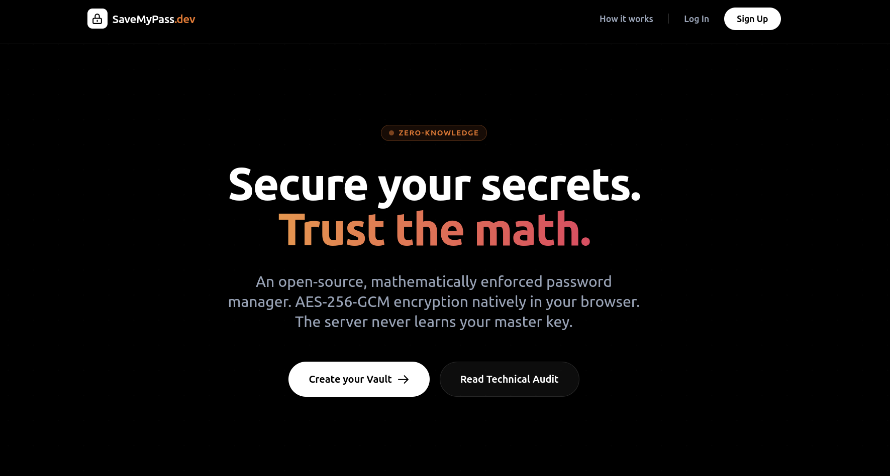
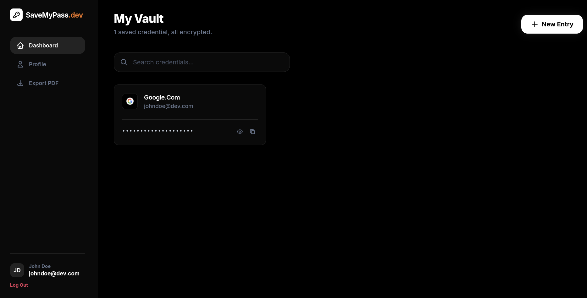

# SaveMyPass.dev — Secure Credential Management System



## Project Description

SaveMyPass.dev is a web application designed for the centralized and secure management of access credentials. The system allows users to store, organize, and retrieve their passwords through an advanced security architecture that guarantees total data privacy.

### The Problem

In today's digital environment, managing multiple digital identities presents critical challenges:
1. Password Fatigue: The difficulty of remembering complex combinations leads to password reuse, increasing vulnerability to brute force attacks or data breaches.
2. Insecure Storage: Many users resort to insecure methods such as plain text documents, physical notes, or native browser storage without robust encryption.
3. Risk Centralization: If a centralized server is compromised and the data is not encrypted on the client side, all credentials are exposed simultaneously.

### Proposed Solution

This project implements a **Zero-Knowledge Architecture**. The solution is based on the server acting solely as a repository for encrypted data, while encryption and decryption operations occur exclusively in the client environment (browser). In this way, neither system administrators nor potential attackers with backend access can view the users' actual passwords.

---

## Key Features



- **End-to-End Encryption**: Implementation of modern cryptographic standards to ensure that sensitive data never travels in plain text.
- **Decoupled Architecture**: Robust backend based on microservices and a reactive frontend optimized for performance.
- **Secure Session Management**: Use of JSON Web Tokens (JWT) with controlled expiration times.
- **Data Export**: Native functionality to back up credentials in portable formats such as PDF and CSV.
- **Strict Validation**: Data integrity control on both frontend and backend through schema validations.

---

## Technologies Used

### Backend
- **Java 17**: Base language for its robustness and strict typing.
- **Spring Boot 3.4.x**: Main framework for REST API development.
- **Spring Security**: Configuration of security filters, CORS, and protection against common vulnerabilities.
- **Hibernate / JPA**: Abstraction layer for data persistence.
- **PostgreSQL**: Relational database engine for persistent storage.
- **Project Lombok**: For reducing boilerplate code in DTOs and Entities.

### Frontend
- **Vue.js 3**: Progressive framework for building a dynamic interface.
- **Vite**: Ultra-fast build tool and development server.
- **Pinia**: Global state management system (Store).
- **Axios**: HTTP client for persistent communication with the API.
- **Web Crypto API**: Native browser implementation for high-performance cryptographic operations.

---

## Security Model

The fundamental pillar of SaveMyPass.dev is its cryptographic model:

1. **Key Derivation (KDF)**: The **PBKDF2** algorithm is used with SHA-256 and an iteration factor of **600,000**, mitigating dictionary and specialized hardware attacks.
2. **Symmetric Encryption**: Credentials are encrypted using 256-bit **AES-GCM** (Advanced Encryption Standard in Galois/Counter Mode), providing both confidentiality and integrity.
3. **Initialization Vector (IV)**: Each encrypted entry has its own unique 12-byte IV, ensuring that the same plain text generates different output in each operation.

---

## Prerequisites

Before starting execution, ensure you have the following components installed:
- **JDK 17** or higher.
- **Node.js v18** or higher.
- **npm** (v9+).
- **PostgreSQL 14** or higher.
- **Maven 3.8+**.

---

## Execution Guide

### 1. Database Configuration

Create a database in PostgreSQL named `savemypass.dev` or adjust the name according to your preference.

### 2. Environment Configuration (Backend)

Locate the `src/main/resources/application.properties` file and configure the necessary variables:

```properties
spring.datasource.url=jdbc:postgresql://localhost:5432/your_database_name
spring.datasource.username=your_user
spring.datasource.password=your_password
jwt.secret=random_string_of_at_least_64_characters
```

### 3. Run the Backend Server

From the project root, run:
```bash
./mvnw clean spring-boot:run
```
The server will be available by default at `http://localhost:8080`.

### 4. Frontend Configuration and Execution

Navigate to the frontend directory:
```bash
cd frontend
```

Install dependencies:
```bash
npm install
```

Start the development server:
```bash
npm run dev
```
The web application will be available at the URL provided by Vite (usually `http://localhost:5173`).

---

## Project Structure

```text
.
├── src/main/java          # Backend source code (Controllers, Services, DTOs)
├── src/main/resources     # Configurations and static resources
├── frontend/src           # Client logic (Vue Components, Stores, Crypto)
├── pom.xml                # Maven dependencies
└── README.md              # Technical documentation
```

---

## Integrity Notes

All stored passwords are encrypted before being sent to the server. The security of the system depends critically on the strength of the **Master Password** defined by the user, as this is the only key capable of deriving the secrets necessary for decryption.
